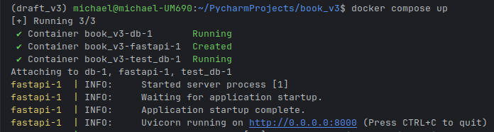
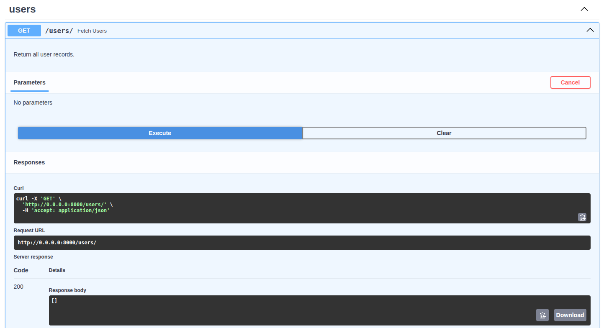
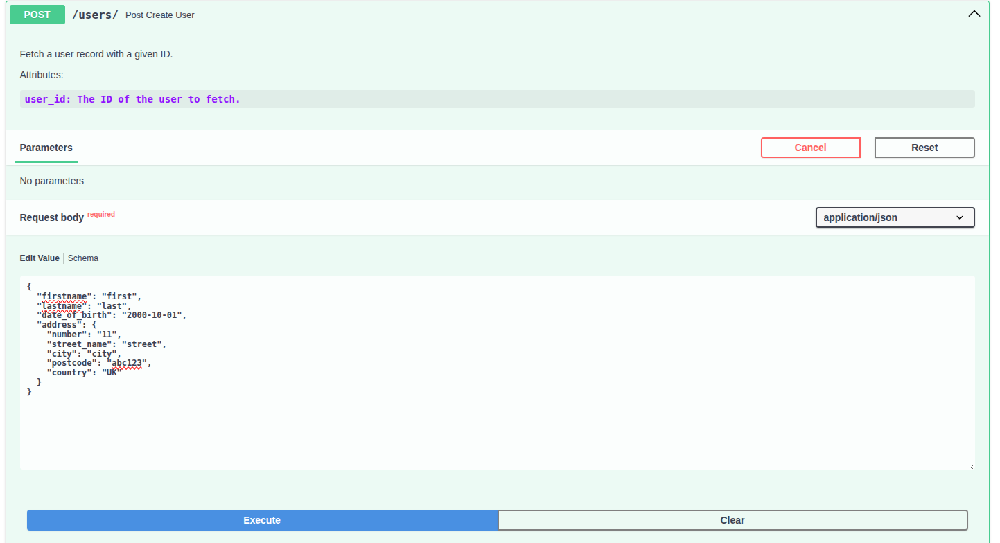

# Coding Challenge #

This is a application which allows the following operations:

* Create a user.
* Read a user.
* Update a user.
* Delete a user.

Please note that this application is designed for a coding challenge. The instructions below include additional steps 
for the reviewer, as the database is typically pre-configured for end users. The `dotenv_example` file contains 
hard-coded database credentials, which should never be committed to Git history. This file is provided solely for the 
reviewer’s use to run the application.

## Quick Start (Docker) ##
1. Copy the `dotenv_example` file to `.env` in the same directory.
2. Open a terminal in the project root directory.
3. Start the services by typing: `docker compose up --build`
4. In the terminal type: `alembic upgrade head`
5. Open the API docs: `http://0.0.0.0:8000`



If everything is running, you should see logs in the terminal and be able to load the API docs page.

### Read Users ###
Use the GET /users/ endpoint to fetch a list of all current users:

As there are no users currently in the database, an empty list is returned.

### Create Users ###
Using the POST /users/ endpoint, amend the user details and click Execute to create a user.



Verify the user record was added using the GET /users/ endpoint, and you should see the user just created:

```json
{
  "firstname": "first",
  "lastname": "last",
  "date_of_birth": "2000-10-01",
  "address": {
    "number": "11",
    "street_name": "street",
    "city": "city",
    "postcode": "abc123",
    "country": "UK"
  }
}
```
Verify this update by using the GET /users/ endpoint:

### Update Users ###
Use the PATCH /users/ endpoint to amend a detail of the user e.g. firstname:

```json
{
  "firstname": "first",
  "id": 1,
  "lastname": "last",
  "date_of_birth": "2000-10-01",
  "address": {
    "number": "11",
    "street_name": "street",
    "city": "city",
    "postcode": "abc123",
    "country": "UK"
  }
}
```

### Delete Users ###
Delete a user by entering their ID number using the DELETE /users/ endpoint. Verify the user was deleted using the GET /users/ endpoint and confirming the user no longer exists.


## Tech Stack

- Python 3.13
- FastAPI (served via Docker)
- SQLAlchemy + Alembic migrations
- Pytest for tests
- Docker Compose for local orchestration